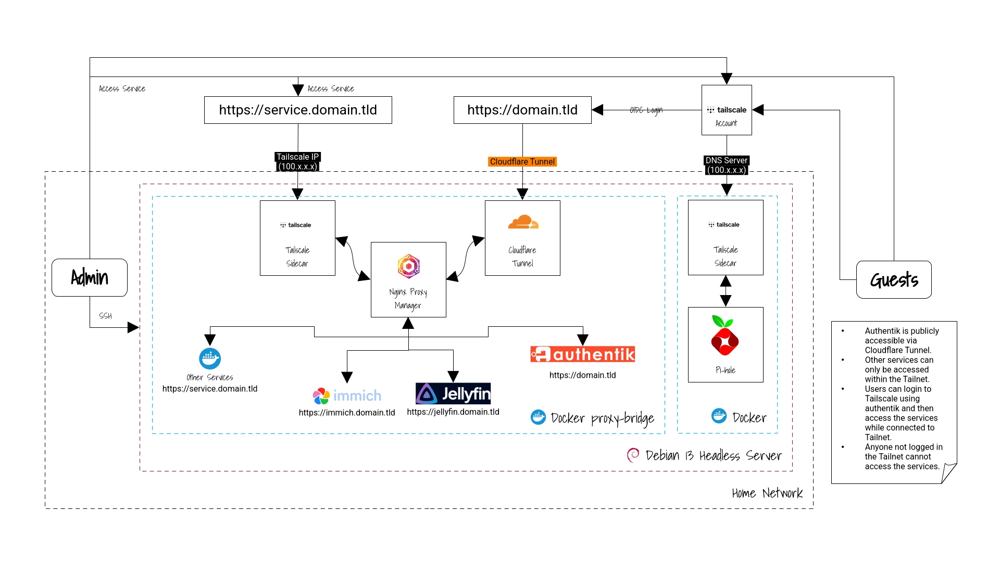

# My HomeLab

<em>v2 HomeLab Diagram</em>

## Setup Overview:

- A Linux machine as a server with Docker installed.
- Admin can manage the server through SSH from another machine.
- Cloudflare Tunnel as a sidecar to make certain services publicly accessible.
  - authentik will be publicly accessible to be used for Tailscale sign up and login.
- Tailscale sidecar for Nginx Proxy Manager.
  - Will make the other services not be publicly accessible.
- Nginx Proxy Manager
  - Everything is connected through the `proxy-bridge` network in Docker.
  - All traffic will route through Nginx.
    - The root domain that comes from Cloudflare Tunnel will be forwarded to authentik.
    - The sub domains that are pointing to the Tailscale IP will be forwarded to their respective services.
- Tailscale sidecar for Pi-hole.
  - Isolate Pi-hole to it's own machine so we can set our Tailscale DNS nameservers to point to the Pi-hole container.

## Version Notes

- `v2.x.x` - Uses Nginx as reverse proxy.
  - Current `main` branch.
  - Recommended if you have a custom domain.
- `v1.x.x` - Uses Tailscale as sidecar.
  - Please see `support/v1` branch.
  - Recommended for beginners, standalone services or Tailscale only setup.

## Docker

**Official website:** https://www.docker.com

### Running Services

- [**Nginx Proxy Manager** with **Tailscale** and **Cloudflare Tunnel**](/nginx-proxy-manager/)
  - A reverse proxy
  - https://nginxproxymanager.com/guide/#quick-setup
- [**Authentik**](/authentik/)
  - An IdP (Identity Provider) and SSO (Single Sign On) platform
  - https://docs.goauthentik.io/install-config/install/docker-compose
- [**Jellyfin**](/jellyfin-server/)
  - A media server
  - https://jellyfin.org/docs/general/installation/container
- [**Immich**](/immich-server/)
  - A photo and video management solution
  - https://docs.immich.app/install/docker-compose
- [**Vaultwarden**](/vaultwarden-server/)
  - A password manager, alternate implementation of Bitwarden
  - https://github.com/dani-garcia/vaultwarden
- [**Pi-hole** with Tailscale](/pihole/)
  - A DNS/Ad blocker
  - https://github.com/pi-hole/docker-pi-hole/#running-pi-hole-docker
- [**Forgejo**](/forgejo-server/)
  - A Git Repository
  - https://forgejo.org/docs/latest/admin/installation/docker/
- [**Navidrome**](/navidrome-server/)
  - A music server
  - https://www.navidrome.org/docs/installation/docker
- [**RomM**](/romm-server/)
  - A ROM Manager with emulator
  - https://github.com/rommapp/romm/blob/master/examples/docker-compose.example.yml
- [**Linkwarden**](/linkwarden-server//)
  - A bookmark manager
  - https://docs.linkwarden.app/self-hosting/installation

## Setup

Clone the repository or download necessary docker compose and env files and follow the [Wiki page](../../wiki).
